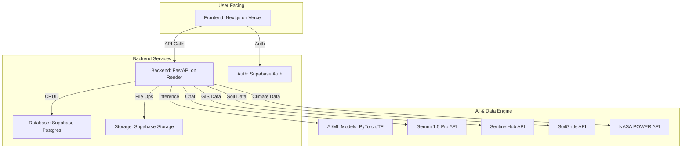

# TerraMind – AI-Powered Land Regeneration Assistant 🌍

TerraMind is an expert full-stack AI software engineer responsible for developing a web app called TerraMind, an AI-driven system that empowers environmental sustainability through land analysis and regenerative agriculture recommendations. It analyzes land via imagery and GIS data, computes vegetation indices, detects degradation, recommends regenerative practices, and tracks recovery progress with a Gemini-powered assistant.

## 📖 Project Overview

TerraMind is a production-ready platform designed to empower farmers, NGOs, and environmental agencies to make data-driven decisions for land restoration. By integrating satellite imagery, soil data, and climate information, our AI engine provides actionable insights to combat land degradation and promote sustainable agriculture.

### Key Features
- **Land Health Analysis**: Computes NDVI/EVI from satellite imagery to assess vegetation health.
- **Degradation Detection**: Uses ML models to identify soil degradation and water stress.
- **AI-Powered Recommendations**: Suggests regenerative crops and trees based on soil, climate, and land conditions.
- **Progress Tracking**: Monitors land recovery over time with trend analysis.
- **Gemini Assistant**: An interactive chat assistant for expert advice and explanations on sustainability topics.
- **Interactive Dashboard**: Visualizes data through maps, charts, and detailed reports.

---

## 🔗 Repository Link

**The GitHub repository for this project can be found at:**
[`https://github.com/ArchAtitocodes/`](https://github.com/ArchAtitocodes/PLP-HACKATHON3-TerraMind.git)


 [PITCH](https://www.canva.com/design/DAG1l80baI0/m18F-kELQDIE7eUmrcvzvw/edit?utm_content=DAG1l80baI0&utm_campaign=designshare&utm_medium=link2&utm_source=sharebutton)
---

## 🧱 Architecture Diagram

Below is the high-level architecture of the TerraMind platform.

*(A placeholder for `architecture_diagram.png` which you can create using tools like `diagrams.net` or Mermaid.)*



---

## 🛠 Setup Instructions

Follow these steps to set up and run the project locally.

### 1. Prerequisites
- Node.js (v18 or later)
- Python 3.11
- Docker (optional, for containerized backend)
- Git
- A Supabase account (for database, auth, and storage)
- API keys for:
  - Google Gemini
  - SentinelHub
  - Mapbox

### 2. Environment Variables

Create a `.env` file in the root of the project by copying `.env.example` and fill in the required values from your service provider dashboards.

```bash
cp .env.example .env
```

Fil
I)
nt
### 4. Frontend Setup (Next.js)

```bash
# Navigate to the frontend directory
cd frontend

# Install dependencies
npm install

# Run the development server
npm run dev
```
The frontend will be available at `http://localhost:3000`.

### 5. Supabase Database Setup

1. Go to your Supabase project's SQL Editor.
2. Run the SQL script located in `docs/supabase_schema.sql` to create the required tables.
3. Go to the "Authentication" -> "Policies" section and add the Row Level Security policies found in the same SQL file.

---

## 🌐 API Documentation

The backend exposes the following RESTful endpoints.

- `POST /api/analyze_land_coords`: Analyzes land from coordinates.
- `POST /api/recommend_crop`: Recommends crops based on analysis data.
- `GET /api/track_progress/{plot_id}`: Tracks the regeneration progress of a land plot.
- `POST /api/chat_regen`: Powers the conversational AI assistant.

For detailed request/response schemas, please see `docs/api_reference.md`.

---

## 🤖 AI & ML Model Overview

- **NDVI/EVI Analysis**: Uses `OpenCV` and `NumPy` to calculate vegetation indices from multi-band satellite imagery.
- **Crop Recommendation Model**: A placeholder `scikit-learn` classifier that suggests crops based on simulated soil and climate data. This can be replaced with a more sophisticated model.
- **Progress Trend Model**: A simple time-series regression model to analyze NDVI changes over time.

---

## 💬 Gemini Assistant Example Prompts


> "Explain NDVI in simple terms."
> "My land has a low soil quality score of 45. What are three immediate steps I can take to improve it?"
> "Based on my latest analysis, recommend three drought-resistant crops suitable for sandy soil."
> "What is regenerative agriculture and why is it important?"

---

## 🚀 Deployment Instructions

### 1. Create a GitHub Repository

Use the GitHub CLI or website to create a new repository named `TerraMind`.

### 2. Push Code to GitHub

Initialize a git repository locally and push the code.

```bash
git init -b main
git add .
git commit -m "Initial TerraMind release"
git remote add origin https://github.com/<YOUR_GITHUB_USERNAME>/TerraMind.git
git push -u origin main
```

### 3. Deploy Frontend to Vercel
1. Connect your GitHub account to Vercel.
2. Import the `TerraMind` repository.
3. Vercel will auto-detect it's a Next.js project. Set the root directory to `frontend`.
4. Add your `NEXT_PUBLIC_` environment variables to the Vercel project settings.
5. Deploy!

### 4. Deploy Backend to Render
1. Create a new "Web Service" on Render and connect your GitHub repository.
2. Set the root directory to `backend`.
3. Set the build command to `pip install -r requirements.txt`.
4. Set the start command to `uvicorn main:app --host 0.0.0.0 --port $PORT`.
5. Add all required backend environment variables.
6. Deploy!

The included `.github/workflows/deploy.yml` provides a CI/CD pipeline for automated deployments.

---

## 🔐 Security Best Practices

- **Never commit secrets**: Use environment variables for all API keys and credentials.
- **Supabase RLS**: Enable Row Level Security (RLS) on all Supabase tables to ensure users can only access their own data.
- **Input Validation**: All API endpoints use Pydantic for strict data validation.
- **CORS**: The FastAPI backend is configured with a CORS policy to only allow requests from the frontend domain.

---

## 🧭 Future Roadmap

- **Integrate Drone Imagery**: Allow high-resolution analysis from drone uploads.
- **Advanced Segmentation Models**: Use U-Net or other segmentation models for more precise degradation detection.
- **Carbon Sequestration Estimates**: Calculate the potential carbon offset from recommended regenerative practices.
- **Community Features**: Allow users to share their progress and successful strategies.

---

## 📜 License

This project is licensed under the **MIT License**. See the LICENSE file for details.
